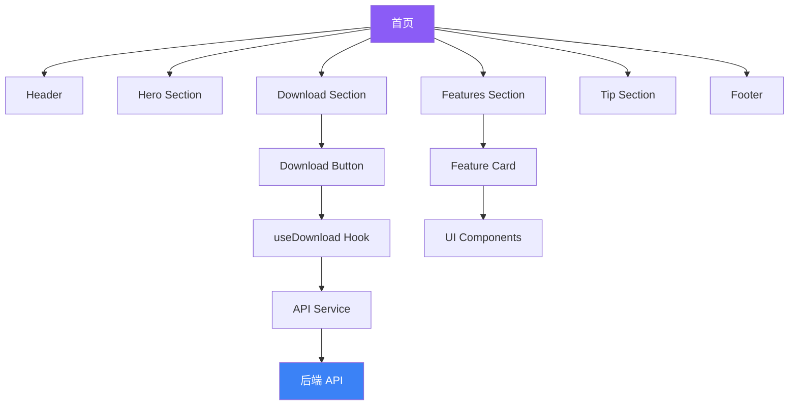

# 技术架构文档

## 1. 系统架构概览

### 1.1 整体架构
本网站采用现代化的前端架构，基于 Next.js 16 App Router 构建，采用组件化、模块化的设计理念。

```
┌─────────────────────────────────────────────────────────────┐
│                        客户端浏览器                           │
└─────────────────────────────────────────────────────────────┘
                              │
                              │ HTTP/HTTPS
                              ▼
┌─────────────────────────────────────────────────────────────┐
│                    Next.js 应用服务器                         │
│  ┌──────────────────────────────────────────────────────┐   │
│  │               App Router (路由层)                     │   │
│  │  ┌──────────────┐  ┌──────────────┐                 │   │
│  │  │   首页 (/)    │  │  API 路由    │                 │   │
│  │  │              │  │  (/api/...)  │                 │   │
│  │  └──────────────┘  └──────────────┘                 │   │
│  └──────────────────────────────────────────────────────┘   │
│  ┌──────────────────────────────────────────────────────┐   │
│  │              React 组件层                             │   │
│  │  - 页面组件 (Pages)                                   │   │
│  │  - 布局组件 (Layout)                                  │   │
│  │  - 业务组件 (Business Components)                     │   │
│  │  - UI 组件 (UI Components - shadcn/ui)               │   │
│  └──────────────────────────────────────────────────────┘   │
│  ┌──────────────────────────────────────────────────────┐   │
│  │              服务层 (Services)                        │   │
│  │  - API 调用封装                                       │   │
│  │  - 业务逻辑处理                                       │   │
│  └──────────────────────────────────────────────────────┘   │
└─────────────────────────────────────────────────────────────┘
                              │
                              │ HTTP/HTTPS
                              ▼
┌─────────────────────────────────────────────────────────────┐
│                    后端 API 服务                              │
│  - 文件下载接口                                              │
│  - 数据查询接口                                              │
└─────────────────────────────────────────────────────────────┘
```

---

## 2. 技术栈详细说明

### 2.1 核心框架
- **Next.js 16**
  - 使用 App Router 进行路由管理
  - 支持服务端渲染 (SSR) 和静态生成 (SSG)
  - 内置图片优化和性能优化

- **React 19**
  - 使用最新的 Hooks API
  - 组件化开发
  - 支持 Server Components 和 Client Components

- **TypeScript 5**
  - 静态类型检查
  - 提升代码可维护性
  - 更好的 IDE 支持

### 2.2 UI 层
- **shadcn/ui**
  - 基于 Radix UI 的高质量组件库
  - 可定制性强
  - 无障碍支持

- **Tailwind CSS 4**
  - 原子化 CSS 框架
  - 快速开发响应式布局
  - 支持自定义主题

- **Lucide React**
  - 现代化的图标库
  - 支持 Tree-shaking
  - 丰富的图标选择

### 2.3 状态管理
- **React Context API**
  - 用于全局状态管理（如主题）
  
- **useState/useReducer**
  - 用于组件内部状态管理

### 2.4 数据获取
- **原生 Fetch API**
  - 用于调用后端接口
  - 支持请求拦截和响应处理

### 2.5 开发工具
- **pnpm**
  - 快速、磁盘空间高效的包管理器
  - 必须使用，严禁 npm 或 yarn

- **ESLint**
  - 代码质量检查
  - React 和 TypeScript 规则

---

## 3. 目录结构设计

```
mini-dreamer/
├── public/                          # 静态资源
│   ├── favicon.ico                  # 网站图标
│   └── images/                      # 图片资源
│       ├── logo.png                 # Logo
│       └── hero-bg.jpg              # 英雄区背景
│
├── src/
│   ├── app/                         # Next.js App Router
│   │   ├── layout.tsx               # 根布局
│   │   ├── page.tsx                 # 首页
│   │   ├── globals.css              # 全局样式
│   │   └── api/                     # API 路由
│   │       └── download/
│   │           └── route.ts         # 下载 API
│   │
│   ├── components/                  # 组件目录
│   │   ├── ui/                      # Shadcn UI 组件（保留现有）
│   │   │   ├── button.tsx
│   │   │   ├── card.tsx
│   │   │   └── ...
│   │   │
│   │   ├── layout/                  # 布局组件
│   │   │   ├── header.tsx           # 顶部导航
│   │   │   ├── footer.tsx           # 页脚
│   │   │   └── index.ts             # 导出文件
│   │   │
│   │   ├── sections/                # 页面区块组件
│   │   │   ├── hero-section.tsx     # 英雄区
│   │   │   ├── features-section.tsx # 功能展示区
│   │   │   ├── download-section.tsx # 下载区
│   │   │   ├── tip-section.tsx      # 操作提示区
│   │   │   └── index.ts             # 导出文件
│   │   │
│   │   ├── feature-card.tsx         # 功能卡片组件
│   │   └── download-button.tsx      # 下载按钮组件
│   │
│   ├── lib/                         # 工具库
│   │   ├── api.ts                   # API 调用封装
│   │   └── utils.ts                 # 通用工具函数（保留现有）
│   │
│   ├── types/                       # TypeScript 类型定义
│   │   ├── download.ts              # 下载相关类型
│   │   └── index.ts                 # 类型导出
│   │
│   └── hooks/                       # 自定义 Hooks
│       └── use-download.ts          # 下载逻辑 Hook
│
├── .env.local                       # 环境变量（不提交到 Git）
├── .env.example                     # 环境变量示例
├── next.config.ts                   # Next.js 配置
├── tsconfig.json                    # TypeScript 配置
├── tailwind.config.ts               # Tailwind 配置
├── postcss.config.js                # PostCSS 配置
└── package.json                     # 项目依赖
```

---

## 4. 核心模块设计

### 4.1 页面布局 (Layout)

#### 4.1.1 根布局 (app/layout.tsx)
```typescript
// 主要职责
- 提供 HTML 结构
- 设置全局元数据
- 引入全局样式
- 配置主题提供者
- 包含顶部导航和页脚
```

#### 4.1.2 首页 (app/page.tsx)
```typescript
// 主要职责
- 组合各个区块组件
- 控制页面整体布局
- 管理页面级状态
```

### 4.2 核心组件

#### 4.2.1 导航栏 (components/layout/header.tsx)
```typescript
interface HeaderProps {
  // 导航链接配置
  links: Array<{
    label: string;
    href: string;
  }>;
}

// 功能
- 显示 Logo 和产品名称
- 提供导航链接
- 响应式菜单（移动端汉堡菜单）
- 主题切换（可选）
```

#### 4.2.2 英雄区 (components/sections/hero-section.tsx)
```typescript
interface HeroSectionProps {
  title: string;
  subtitle: string;
  features: string[];
  onDownload: () => void;
}

// 功能
- 展示核心价值主张
- 提供主要下载入口
- 视觉冲击力强的设计
```

#### 4.2.3 功能展示区 (components/sections/features-section.tsx)
```typescript
interface Feature {
  icon: React.ReactNode;
  title: string;
  description: string;
  isHighlight?: boolean;
}

interface FeaturesSectionProps {
  features: Feature[];
}

// 功能
- 网格布局展示功能卡片
- 卡片悬停动画
- 响应式布局
```

#### 4.2.4 下载按钮 (components/download-button.tsx)
```typescript
interface DownloadButtonProps {
  onDownload: () => Promise<void>;
  loading?: boolean;
  disabled?: boolean;
}

// 功能
- 处理点击事件
- 显示加载状态
- 触发下载逻辑
```

### 4.3 API 集成模块

#### 4.3.1 API 封装 (lib/api.ts)
```typescript
// API 配置
const API_BASE_URL = process.env.NEXT_PUBLIC_API_BASE_URL;
const API_TOKEN = process.env.API_TOKEN;

// 请求拦截器
const requestInterceptor = {
  headers: {
    'Authorization': `Bearer ${API_TOKEN}`,
    'Content-Type': 'application/json'
  }
};

// 获取最新文件信息
export async function getLatestFile(): Promise<DownloadResponse> {
  const response = await fetch(`${API_BASE_URL}/run`, {
    method: 'POST',
    headers: requestInterceptor.headers,
    body: JSON.stringify({
      action: 'get_latest_file',
      params: {}
    })
  });
  
  const data = await response.json();
  
  if (data.error) {
    throw new Error(data.error);
  }
  
  return data.result;
}

// 触发浏览器下载
export async function downloadFile(url: string, fileName: string): Promise<void> {
  const link = document.createElement('a');
  link.href = url;
  link.download = fileName;
  document.body.appendChild(link);
  link.click();
  document.body.removeChild(link);
}
```

#### 4.3.2 下载 API 路由 (app/api/download/route.ts)
```typescript
// 可选：使用 Next.js API 路由作为代理
// 避免在客户端暴露 API Token

export async function POST() {
  try {
    const result = await getLatestFile();
    return Response.json(result);
  } catch (error) {
    return Response.json(
      { error: '获取下载链接失败' },
      { status: 500 }
    );
  }
}
```

### 4.4 自定义 Hook

#### 4.4.1 下载逻辑 Hook (hooks/use-download.ts)
```typescript
interface UseDownloadReturn {
  download: () => Promise<void>;
  loading: boolean;
  error: string | null;
}

export function useDownload(): UseDownloadReturn {
  const [loading, setLoading] = useState(false);
  const [error, setError] = useState<string | null>(null);

  const download = async () => {
    setLoading(true);
    setError(null);
    
    try {
      const result = await getLatestFile();
      await downloadFile(result.download_url, result.file_name);
      
      // 显示成功提示（使用 Sonner）
      toast.success('下载已开始', { duration: 2000 });
    } catch (err) {
      setError(err.message);
      
      // 显示错误提示（使用 Sonner）
      toast.error('下载失败，请稍后重试', { duration: 3000 });
    } finally {
      setLoading(false);
    }
  };

  return { download, loading, error };
}
```

### 4.5 类型定义

#### 4.5.1 下载相关类型 (types/download.ts)
```typescript
export interface DownloadResponse {
  id: number;
  file_name: string;
  file_version: string;
  storage_key: string;
  download_url: string;
  url_expire_time: string;
  created_at: string;
  updated_at: string;
}

export interface ApiError {
  error: string;
}
```

---

## 5. 数据流设计

### 5.1 下载流程数据流
```
用户点击下载按钮
       │
       ▼
触发 useDownload Hook
       │
       ▼
调用 getLatestFile API
       │
       ├─ 成功 → 获取 download_url
       │           │
       │           ▼
       │       调用 downloadFile
       │           │
       │           ▼
       │       浏览器开始下载
       │           │
       │           ▼
       │       显示成功提示
       │
       └─ 失败 → 显示错误提示
```

### 5.2 页面渲染流程
```
用户访问首页 (/)
       │
       ▼
Next.js 路由匹配
       │
       ▼
渲染 app/layout.tsx (根布局)
       │
       ├─ 渲染 Header
       │
       ▼
渲染 app/page.tsx (首页)
       │
       ├─ Hero Section
       ├─ Features Section
       ├─ Download Section
       ├─ Tip Section
       │
       ▼
渲染 Footer
```

---

## 6. 样式架构

### 6.1 全局样式 (app/globals.css)
```css
/* 导入 Tailwind */
@import "tailwindcss";

/* 导入自定义字体 */
@import url('https://fonts.googleapis.com/css2?family=Poppins:wght@400;600;700&display=swap');

/* 全局样式 */
:root {
  --primary: #8B5CF6;    /* 主色 - 游戏感紫色 */
  --secondary: #3B82F6;  /* 辅助色 - 科技蓝 */
  --background: #0F172A; /* 背景 - 深色 */
  --foreground: #F8FAFC; /* 文字 - 浅色 */
}

/* 自定义动画 */
@keyframes fadeInUp {
  from {
    opacity: 0;
    transform: translateY(30px);
  }
  to {
    opacity: 1;
    transform: translateY(0);
  }
}

.animate-fade-in-up {
  animation: fadeInUp 0.6s ease-out forwards;
}
```

### 6.2 组件样式策略
- **原子化 CSS**：使用 Tailwind CSS 工具类
- **响应式设计**：使用 Tailwind 断点前缀 (sm:, md:, lg:)
- **动态样式**：使用 class-variance-authority (CVA)
- **主题切换**：支持明暗主题（使用 next-themes）

---

## 7. 性能优化策略

### 7.1 加载性能
- **代码分割**：
  - 动态导入非首屏组件
  - 使用 React.lazy() 和 Suspense

- **图片优化**：
  - 使用 Next.js Image 组件
  - 自动压缩和格式转换
  - 响应式图片

- **字体优化**：
  - 使用 next/font 优化字体加载
  - 字体预加载

### 7.2 运行时性能
- **避免不必要的重渲染**：
  - 使用 React.memo
  - 合理使用 useMemo 和 useCallback

- **动画性能**：
  - 优先使用 CSS 动画
  - 使用 transform 和 opacity（GPU 加速）
  - 避免布局抖动

### 7.3 网络性能
- **API 缓存**：
  - 使用 React Query 或 SWR（如果需要）
  - 合理设置缓存策略

- **资源预加载**：
  - 预连接 API 域名
  - 预加载关键资源

---

## 8. 安全策略

### 8.1 环境变量管理
```bash
# .env.local（不提交到 Git）
NEXT_PUBLIC_API_BASE_URL=https://4b7svf8rpf.coze.site
API_TOKEN=eyJhbGciOiJSUzI1NiIs...

# .env.example（提交到 Git）
NEXT_PUBLIC_API_BASE_URL=
API_TOKEN=
```

### 8.2 API 安全
- **Token 不暴露给客户端**：
  - 使用 Next.js API 路由作为代理
  - 服务端持有 API Token

- **HTTPS 强制**：
  - 生产环境强制使用 HTTPS
  - API 调用使用 HTTPS

### 8.3 XSS 防护
- 避免使用 dangerouslySetInnerHTML
- 对用户输入进行验证和转义
- 设置 Content Security Policy (CSP)

---

## 9. 错误处理策略

### 9.1 API 错误处理
```typescript
try {
  const result = await getLatestFile();
  // 处理成功
} catch (error) {
  if (error instanceof NetworkError) {
    toast.error('网络错误，请检查网络连接', { duration: 3000 });
  } else if (error instanceof ApiError) {
    toast.error(error.message, { duration: 3000 });
  } else {
    toast.error('下载失败，请稍后重试', { duration: 3000 });
  }
}
```

### 9.2 全局错误处理
- 使用 Next.js Error Boundary
- 捕获未处理的 Promise 拒绝
- 记录错误日志（可选）

---

## 10. 部署架构

### 10.1 构建流程
```bash
# 安装依赖
pnpm install

# 构建生产版本
pnpm build

# 启动生产服务器
pnpm start
```

### 10.2 部署选项
- **Vercel**（推荐）：
  - 零配置部署
  - 自动 CI/CD
  - 全球 CDN

- **自托管**：
  - Docker 容器化
  - Nginx 反向代理
  - HTTPS 配置

### 10.3 环境配置
- **开发环境**：`.env.development.local`
- **生产环境**：`.env.production.local`
- **测试环境**：`.env.test.local`

---

## 11. 监控和日志

### 11.1 性能监控
- 使用 Next.js 内置的性能指标
- 集成 Google Analytics（可选）
- 监控首屏加载时间

### 11.2 错误日志
- 使用 Sentry 等错误追踪工具（可选）
- 控制台错误记录
- API 错误记录

---

## 12. 测试策略

### 12.1 单元测试
- 使用 Jest 和 React Testing Library
- 测试组件渲染逻辑
- 测试 API 调用函数

### 12.2 集成测试
- 测试页面整体功能
- 测试用户交互流程

### 12.3 E2E 测试
- 使用 Playwright 或 Cypress
- 测试下载流程
- 测试响应式布局

---

## 13. 维护和扩展

### 13.1 代码规范
- 遵循 Airbnb Style Guide
- 使用 ESLint 和 Prettier
- 组件命名规范：PascalCase
- 函数命名规范：camelCase

### 13.2 扩展性设计
- **组件复用**：设计可复用的基础组件
- **配置驱动**：使用配置文件管理内容和功能
- **类型安全**：完善的 TypeScript 类型定义

### 13.3 版本控制
- 使用 Git Flow 工作流
- 语义化版本号
- 详细的提交信息

---

## 14. 技术债务管理

### 14.1 已知限制
- 项目重构后需删除大量旧代码
- 需要重新配置 API 路由
- 需要更新样式系统

### 14.2 优化计划
- 第一阶段：完成核心功能
- 第二阶段：优化性能和用户体验
- 第三阶段：添加更多功能（如多语言）

---

## 15. 依赖关系图



---

## 16. 总结

本技术架构文档详细描述了"抽象吧桌宠"官方网站的技术实现方案，包括：

- ✅ 清晰的系统架构设计
- ✅ 完善的技术栈选择
- ✅ 合理的目录结构
- ✅ 模块化的组件设计
- ✅ 安全的 API 集成方案
- ✅ 全面的性能优化策略
- ✅ 可靠的错误处理机制

该架构为项目开发提供了坚实的技术基础，确保网站的专业性、可维护性和可扩展性。